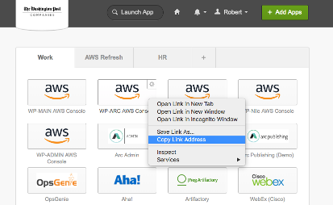

# Clokta: AWS CLI via Okta authentication

Clokta enables you to authenticate into an AWS account using Okta on the command line, so that you can run AWS CLI commands.

## To Install

You will need Python 2.7 or 3 installed on your machine.

Install with

```
> pip install -U clokta
```

If you encounter permissions issues, see [Installation Issues](#install_issues) below

If you have any questions, please post on the #aws-automation Slack channel

## To Use

```shell
> clokta --profile «your-account»
```

This injects temporary keys into your `.aws/credentials` file that can be accessed with the `--profile` option or the `AWS_PROFILE` environment variable

```shell
> clokta --profile elections
> aws --profile elections s3 ls
> export AWS_PROFILE=elections
> aws s3 ls
```

Run AWS commands for the next 6-12 hours.  After 6-12 hours the keys expire and you must rerun clokta.

Applications that access AWS can be run locally if they used the `AWS_PROFILE` environment variable.

A typical run will look something like below.  It uses SMS for MFA.

```shell
elections> clokta --profile elections
Enter a value for okta_password:
Enter SMS text message one time password: 914345
Add the "-i" flag for how to use credentials and override defaults or just run
	export AWS_PROFILE=elections
>
```

and you can always run

```bash
> clokta --help
```

## First Time

The first time you run clokta it will prompt you for your context.  It will ask for the following things

- Okta App URL - this is the URL that uniquely identifies your AWS account in Okta.  Use your browser and sign into Okta, right click on the Okta app that opens an AWS web console on your account, copy the link for that app and paste it into the clokta prompt

  
-  okta_username - your okta username
- okta_org - for Washington Post users,  use **washpost.okta.com**
- multifactor_preference - which MFA mechanism you use with Okta.  Your options are
  - Google Authenticator
  - SMS text message
  - Okta Verify
  - Okta Verify with Push

The Okta App URL you will need to enter whenever you login to a new account.  The others only ever have to be entered once.

These preferences can be changed later by editing your ~/.clokta/clokta.cfg file.

## Docker Containers and Scripts

The `export AWS_PROFILE=«profile»` command allows you to run programs locally  

```shell
> clokta -p elections
> export AWS_PROFILE=elections
> ./bin/run_elex_server
```

But sometimes you need to run things on a remote machine or in a docker container.  For this clokta generates two helpful files which it describes when you use the `-i` flag:

> AWS keys generated.
> To use with docker-compose include
> 	env_file:
> 	    \- ~/.clokta/test-bootstrap.env
> To use with shell scripts include
> 	source ~/.clokta/test-bootstrap.sh
> to use in the current interactive shell run
> 	export AWS_PROFILE=test-bootstrap

If you are building docker containers you can build them with the credentials in the environment using docker-compose's env_file command and referencing the `«profile».env` file that clokta automatically creates.  A sample docker-compose.yml would like

```Yml
version: '2'
services:
  web:
    env_file:
      - ~/.clokta/elections.env
    build: .
    ports:
     - "5000:5000"
    volumes:
     - .:/code
```

If you need to embed the temporary AWS keys themselves into scripts, clokta generates a shell script  `«profile».sh`.  This can be used for script running on remote machines that do not have ~/.aws or ~/.clokta directories.

```bash
export AWS_ACCESS_KEY_ID=ASIAA2CDE6GHIJKLM9OP
export AWS_SECRET_ACCESS_KEY=h73thhHhfdsj3j4jHJHOF9339JLKJF939kJKJL
export AWS_SESSION_TOKEN=FQoGZXIvYXdzEF4aDO...KKiGrt0F
```

## Using Other Regions and Roles

### Specifying a Region

Many AWS CLI commands require the `AWS_REGION` to be defined.  While you can simply specify this on the command line, some users would like the ability to create multiple clokta profiles, one for each region, e.g. `clokta -p eu-pagebuilder` and `clokta -p southeast-pagebuilder`.  This can be done.

1. Create your region specific profile by running clokta
   `clokta -p eu-pagebuilder`

2. Edit your `~/.aws/config` file and add the following lines

   ```
   [profile eu-pagebuilder]
   region = eu-central-1
   ```

This, in conjunction with the `export AWS_PROFILE=eu-pagebuilder` command will tie CLI commands to the Frankfurt region.

### Specifying a Non-Okta Role

A developer may have several Okta-based roles that they can choose from.  Clokta will prompt for which role to use.  But services often have their own non-okta-based roles that they run under granting them the needed permissions that are often more powerful than the tightly restricted developers' roles. So, for developers to run the services locally they need to assume the service's role.  This can be done simply with clokta.

1. Make sure your Okta role has the permission to assume your service's role

2. Make sure your service's role trusts the Okta role 

3. Copy the ARN of your service's role.  You can find it in the AWS console under the IAM service.

4. Edit the `~/.aws/config` file and create a new profile

   ```
   [profile myservice]
   role_arn=«service role's ARN»
   source_profile=myteam
   ```

5. `clokta -p myteam`

6. `export AWS_PROFILE=myservice`

You can now run your process locally and AWS will assume the service role before making any API calls.

## Remembering your Password

Clokta has the ability to remember your password.  Depending on your platform it will store this in the Mac Keychain, Windows Credential Vault or Linux KWallet.  Clokta will prompt you on whether to save your password on first run, but to change it later edit the `save_password_in_keychain` parameter in your `~/.clokta/clokta.cfg` fle.

## <a name="install_issues">Installation Issues</a>

If you encounter permissions errors when installing clokta on a Mac, it is probably because you are using the system python which requires root privileges to install libraries.

##### Option 1 (Recommended): Use brew python

Run `brew install python`

This will install a version of python that installs libraries to `/usr/local` which does not require root permissions.  Then run `pip install clokta`.

##### Option 2: Install using sudo

Run `sudo -H pip install -U clokta`

However, you may encounter

```
Cannot uninstall 'six'. It is a distutils installed project and thus we cannot accurately determine which files belong to it which would lead to only a partial uninstall.
```

It's related to the System Integrity Protection software in the OS ( https://github.com/pypa/pip/issues/3165 ).. the following command should resolve the issue

```
sudo -H pip install --ignore-installed -U python-dateutil six
```

##### Option 3: Install using python3

Some installations require python3 be invoked directly when installing:

```
python3 -m pip install -U clokta
```

If you encounter `PermissionError: [Errno 13] Permission denied` then:
```
sudo python3 -m pip uninstall clokta     # (may need to use python3 vs python2 for uninstall)
```
and then install as indicated above.
